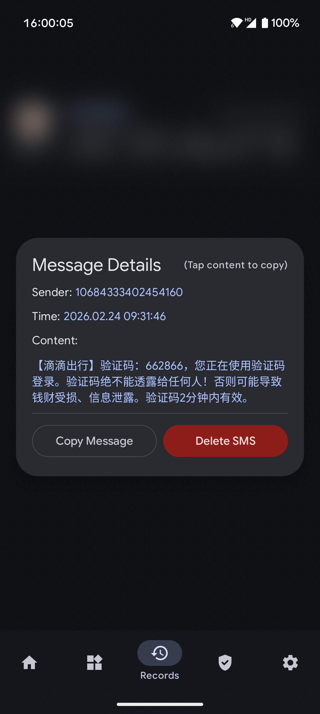
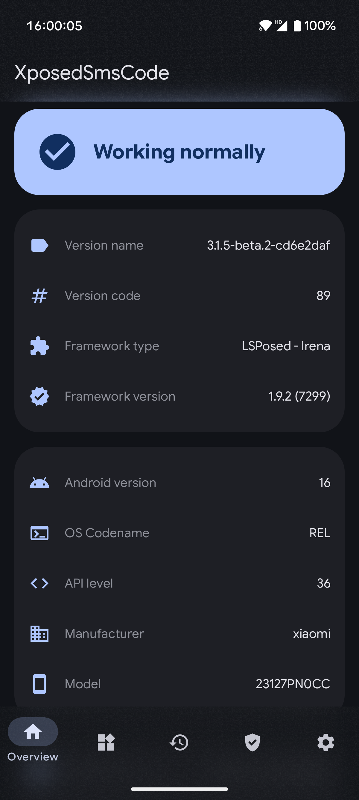
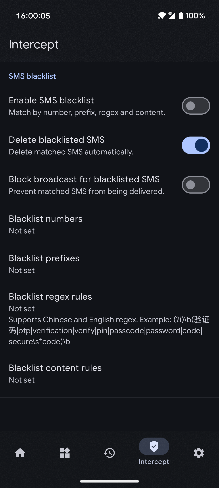

# XposedSmsCode

    

    [-brightgreen?style=flat-square&logo=android)](https://developer.android.com/about/versions/nougat) [-blue?style=flat-square&logo=android)](https://developer.android.com/about/versions)  

An Xposed module which can recognize, parse SMS code and copy it to clipboard when a new message arrives. It can also input SMS code automatically.

[中文版说明](./README.md)

## Refactoring Highlights
- Settings entry migrated to Jetpack Compose; legacy Preference screens removed
- Configuration storage migrated to DataStore; SharedPreferences removed
- Added core/storage modules to split network and backup/serialization logic
- Backup writes schemaVersion/appVersion with import warnings on version gaps
- Rules/records/apps lists upgraded to ListAdapter + DiffUtil

[Refactoring Report](docs/REFACTORING.md)

# Screenshots

    
    

# Communication & Feedback
- [Telegram Group](https://t.me/+NR2QaQ4dlEgxYmNl)

# Usage
1. Root your device and install Xposed Framework.
2. Install and activite this xposed module and then reboot.
3. Enjoy it!

Welcome any feedbacks.

# Attention
- **This module is designed for AOSP-like systems; it may not function correctly on heavily customized ROMs.**
- **Compatibility: Requires Android 15+ (API level ≥ 35).**
- **Supports LSPosed (Android 15+)**
- **Tech Stack: 100% Kotlin + Jetpack Compose + Room + Coroutines**
- **Please read the FAQ in the app first if you encounter any problems.**

# Features
- Copy verification code to clipboard when a new message arrives.
- Show toast when the verification code is copied.
- Show notification when verification SMS parsed.
- Mark verification SMS as read (experimental).
- Delete verification SMS when it's extracted successfully (experimental).
- Block verification SMS if it's extracted successfully.
- Custom keywords about verification code message (regular expressions allowed).
- Support the SMS code match rules customization, importation and exportation.
- Auto-input SMS code.
- **Deep integration for Android 15 (API 35)**
- **Material Design 3 (MD3) + Material You Dynamic Color**
- **100% Kotlin + Coroutines + Room Database**
- **Modern UI built with Jetpack Compose**
- **Settings page fully migrated to Jetpack Compose**

# Documentation
- [Release Logs](docs/CHANGELOG.md)
- [Privacy Policy](docs/PRIVACY.md)

# Thanks To
- [Xposed](https://github.com/rovo89/Xposed)
- [NekoSMS](https://github.com/apsun/NekoSMS)
- [Material Dialogs](https://github.com/afollestad/material-dialogs)
- [EventBus](https://github.com/greenrobot/EventBus)
- [Room](https://developer.android.com/training/data-storage/room)
- [Kotlin Serialization](https://github.com/Kotlin/kotlinx.serialization)
- [Kotlin Coroutines](https://github.com/Kotlin/kotlinx.coroutines)
- [Material Design 3](https://m3.material.io/)
- [Jetpack Compose](https://developer.android.com/jetpack/compose)

# License
All code is licensed under [GPLv3](https://www.gnu.org/licenses/gpl-3.0.txt) 

# Donation
If you find this project helpful, please consider rewarding the developer with a cup of coffee. Your support is the greatest motivation for my persistent maintenance!

| Alipay Red Packet | Alipay Receipt | WeChat Appreciation |
| :---: | :---: | :---: |
|  |  |  |

