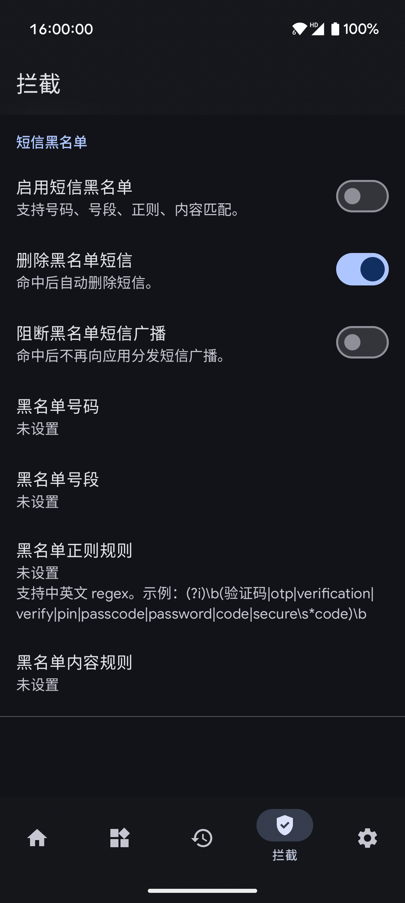
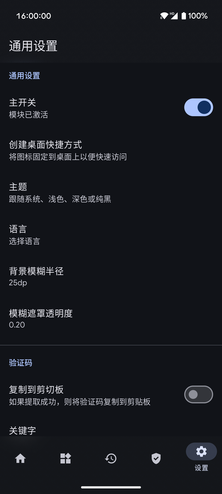

# XposedSmsCode

    

    [-brightgreen?style=flat-square&logo=android)](https://developer.android.com/about/versions/nougat) [-blue?style=flat-square&logo=android)](https://developer.android.com/about/versions)  

识别短信验证码的Xposed模块，并将验证码拷贝到剪切板，亦可以自动输入验证码。

[English Version](./README-EN.md)

## 重构要点
- 设置入口已迁移至 Jetpack Compose，旧 Preference 页面移除
- 配置存储迁移到 DataStore，移除 SharedPreferences
- 新增 core/storage 模块，拆分网络与备份/序列化逻辑
- 备份写入 schemaVersion/appVersion，导入提供版本跨度提示
- 规则/记录/应用列表升级为 ListAdapter + DiffUtil

[重构与现代化报告](docs/REFACTORING.md)

# 应用截图

# 下载

    
    

# 交流与反馈
- [Telegram Group](https://t.me/+NR2QaQ4dlEgxYmNl)

# 使用
1. Root你的设备，安装Xposed框架；
2. 安装本模块，激活并重启；
3. Enjoy it！

欢迎反馈，欢迎提出意见或建议。

# 注意
- **此模块适用于偏原生的系统，其他第三方定制Rom可能不适用。**
- **兼容性：兼容 Android 15 及以上（API 等级 ≥ 35）设备。**
- **支持 LSPosed (Android 15+)**
- **代码库：100% Kotlin + Jetpack Compose + Room + Coroutines**
- **遇到问题请先阅读模块中的"常见问题"**

# 功能
- 收到验证码短信后将验证码复制到系统剪贴板
- 收到验证码时显示Toast
- 收到验证码时显示通知
- 将验证码短信标记为已读（实验性）
- 验证码提取成功后，删除验证码短信（实验性）
- 拦截验证码短信
- 自定义验证码短信关键字（正则表达式）
- 自定义验证码匹配规则，并支持规则导入导出
- 自动输入验证码
- **全系统 Android 15 (API 35) 深度适配**
- **Material Design 3 (MD3) + Material You 动态配色**
- **100% Kotlin + 协程 (Coroutines) + Room 数据库**
- **Jetpack Compose 现代化 UI (FaqFragment 已迁移)**
- **设置页已升级为 Jetpack Compose**

# 文档
- [更新日志 (Changelog)](docs/CHANGELOG.md)
- [重构汇总 (Refactoring Summary)](docs/REFACTORING.md)
- [隐私政策 (Privacy Policy)](docs/PRIVACY.md)

# 感谢
- [Xposed](https://github.com/rovo89/Xposed)
- [NekoSMS](https://github.com/apsun/NekoSMS)
- [Xposed](https://github.com/rovo89/Xposed)
- [NekoSMS](https://github.com/apsun/NekoSMS)
- [Material Dialogs](https://github.com/afollestad/material-dialogs)
- [EventBus](https://github.com/greenrobot/EventBus)
- [Room](https://developer.android.com/training/data-storage/room)
- [Kotlin Serialization](https://github.com/Kotlin/kotlinx.serialization)
- [Kotlin Coroutines](https://github.com/Kotlin/kotlinx.coroutines)
- [Material Design 3](https://m3.material.io/)
- [Jetpack Compose](https://developer.android.com/jetpack/compose)

# 协议
所有的源码均遵循 [GPLv3](https://www.gnu.org/licenses/gpl-3.0.txt) 协议

# 赞助与捐赠
如果您觉得本项目对您有所帮助，欢迎给开发者投喂一杯咖啡。您的支持是我坚持维护的最大动力！

| 支付宝红包口令 | 支付宝收款码 | 微信赞赏码 |
| :---: | :---: | :---: |
|  |  |  |

